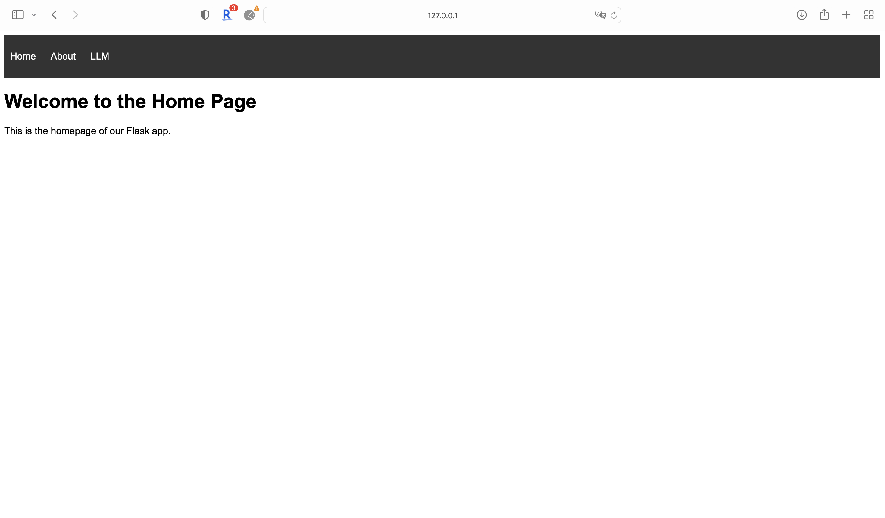

# Azure-Flask-App
In this individual Project 4, a **publicly accessible auto-scaling container using Azure App Services and Flask** has been implemented.

Project dependencies, program sep up steps, and data-driven recommendation has been demonstrated in README.md.

## Project Dependencies
- Platform:
  
  Azure (for App Deployment)
  
  Docker Hub(for docker image management)

  Codespace/VSCode (for Environment Setup)
  
- Libraries:

  Flask==2.3.3
  
  Python==3.10.8

  Docker

## Steps to Run the Programme
### Step1: Set up environment using GitHub Code Spaces/VScode

In this project, VSCode is used for local app development. Necessary packages are shown in requirement.txt.

### Step2: Build up Flask App on VSCode
- Build a basic flask app with the port number 1918 exposed.

- Build Docker File 
  - Build docker container with `sudo docker build -t kkapp .`
 
- Run the App
  - docker run `docker run -p 1918:1918 kkapp`
  - You can see the web rendering of the app at `http://127.0.0.1:1918`

    
    

### Step3: Login to DockerHub via Codespaces/VSCode
- Create a DockerHub repository on Dockerhub:

- log into docker hub on Codespace/VSCode and push the local docker image to remote docker hub repo:
  Commands are shown as below:
  - `docker login --username=lilinkekk`
  - `docker build -t lilinkekk/ids706_individualproject4_ll442 .`
  - `docker push lilinkekk/ids706_individualproject4_ll442`
 
  Local docker image is successfully deployed to docker hub as shown below
  

(Warning - Remember to create the repo before pushing!)

### Step4: Set up Azure Services 

- Log into Azure, search app services and select create (web app)

- When creating the app, select Docker Container

- When selecting the Docker container, point to the correct image tab.

- After deployment you'll need to go configuration and add "WEBSITES_PORT" with a value of 1918 (more below).

   This will allow your app to run on at the public URL provided by Azure.

  - Website Port 

  - Public URL

[ids706individualproject4.azurewebsites.net](https://ids706individualproject4.azurewebsites.net)

## Recommendations

## Video Demo
