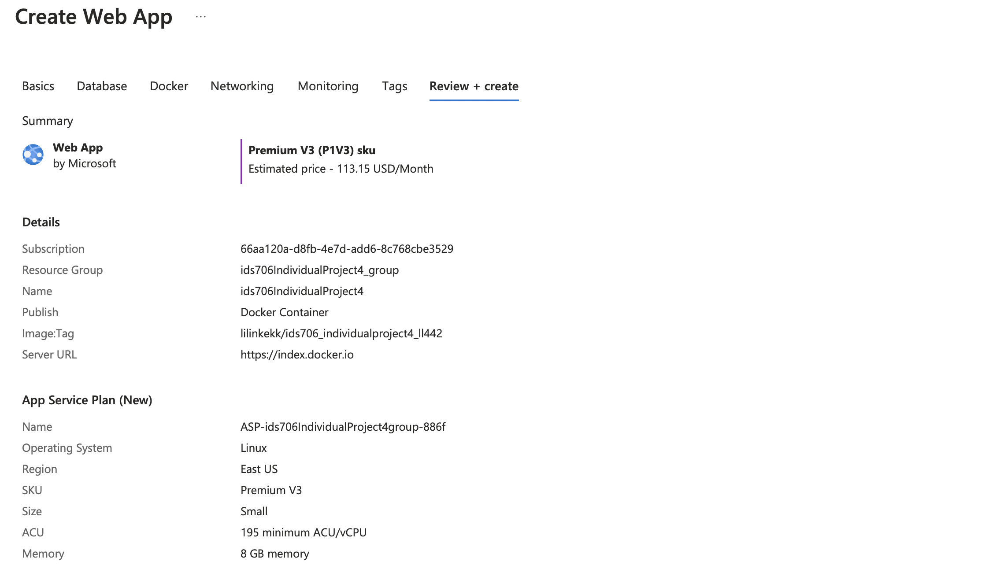

# Azure-Flask-App
This readme will walk you through creating an auto scaling app using GitHub, Docker, and Microsoft App Services 

## Project Dependencies
- Platform:
  Azure (for App Deployment)
  
  Docker Hub(for docker image management)

  Codespace/VSCode (for Environment Setup)
  
- Libraries:

  Flask==2.3.3
  
  Python==3.10.8

  Docker

## Steps to Run the Programme
### Step1: Set up environment using GitHub Code Spaces/VScode

In this project, VSCode is used for development.

### Step2: Build up Flask App on VSCode
- Build a basic flask app with the port number 1918 exposed.

- Build Docker File 
  - docker build `sudo docker build -t kkapp .`
 
- Run the App
  - docker run `docker run -p 1918:1918 kkapp`
  - You can see the web rendering of the app at `http://127.0.0.1:1918`
    
    

### Step3: Login to DockerHub via Codespaces
- 1. Create a DockerHub repository on Dockerhub:

- 2. log into docker hub on Linux and push the local docker image to remote docker hub repo:
  - docker login --username=lilinkekk
  - docker build -t lilinkekk/ids706_individualproject4_ll442 .
  - docker push lilinkekk/ids706_individualproject4_ll442
 
  

Warning: Remember to create the repo before pushing

### Step4: Set up Azure Services 

1. Log into Azure, search app services and select create (web app)

2. When creating the app, select Docker Container

3. When selecting the Docker container, point to the correct image tab.

4. After deployment you'll need to go configuration and add "WEBSITES_PORT" with a value of 1918 (more below).
   This will allow your app to run on at the public URL provided by Azure

Website Port 

Public URL

ids706individualproject4.azurewebsites.net

## Recommendations